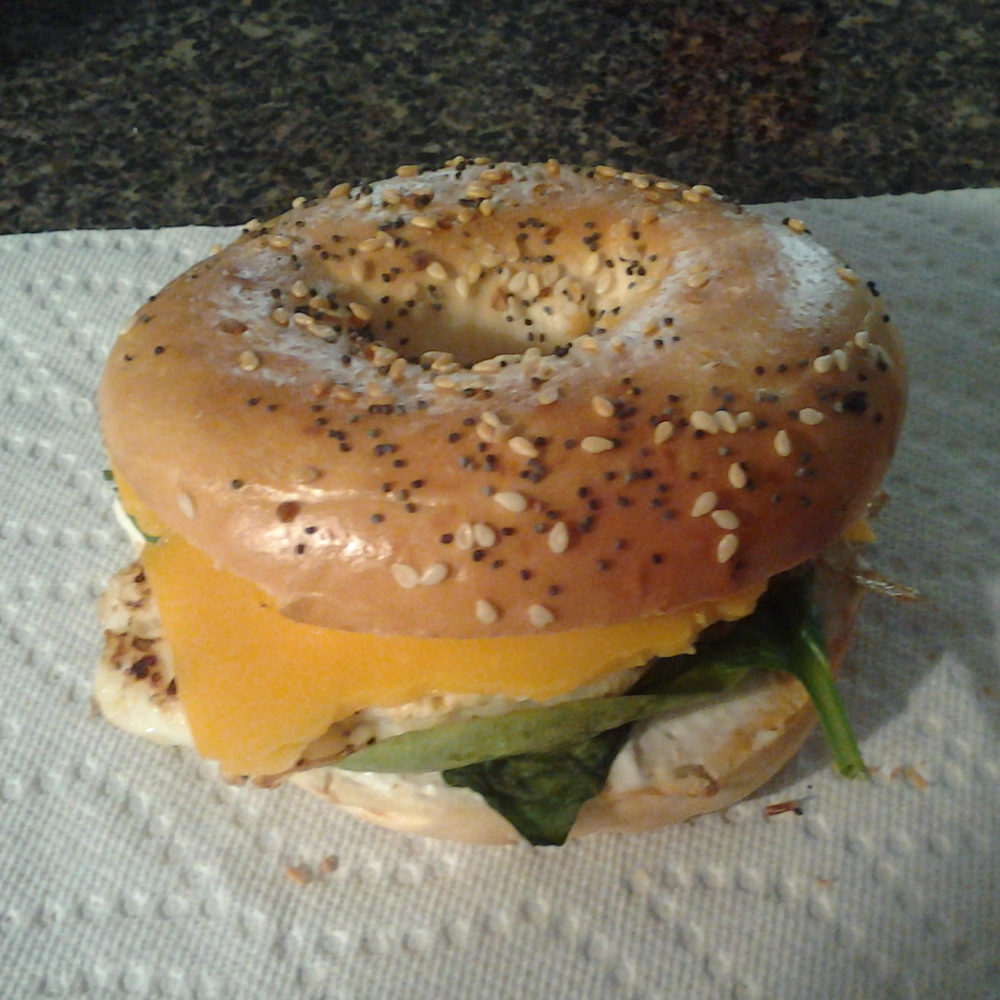

# Breakfast Bagel Sandwich

I developed this sandwich while I was living in Atlanta in the summer of 2014.
When I lived on campus at NC State, my traditional Sunday breakfast was a
bagel sandwich from Bruegger's Bagels -- none of the on-campus eateries
opened early enough to make it to church, and sometimes I'd see people
I knew at Bruegger's.

Our house in Atlanta, however, had no bagel shop within walking distance.
So I developed this sandwich, and since then it's saved me a significant
amount of money compared to eating out on Sunday mornings.

This sandwich is a complete breakfast for one person.
It pairs well with coffee or orange juice.

### Ingredients

* 1 everything bagel
* 1 egg
* 1 slice of cheese (my favorite is Food Lion's Extra Sharp NY Cheddar)
* Baby spinach
* Cream cheese spread

### Equipment

* Skillet, prepared with nonstick spray
* Stove
* Toaster

### Directions

* Toast bagel to medium.
* While toasting the bagel, crack the egg in the skillet,
  and fry it on medium.
* Break the yolk to prevent it from becoming excessively runny,
  unless you like runny yolks. Don't scramble the yolk and white though.
* Flip the egg when the underside starts to brown.
* When the bagel is toasted, apply a light spread of cream cheese to
  the inside of each half.
* When the egg is done, stack the egg, spinach, and cheese on the bagel.
  (Order doesn't really matter.)
* Enjoy!

