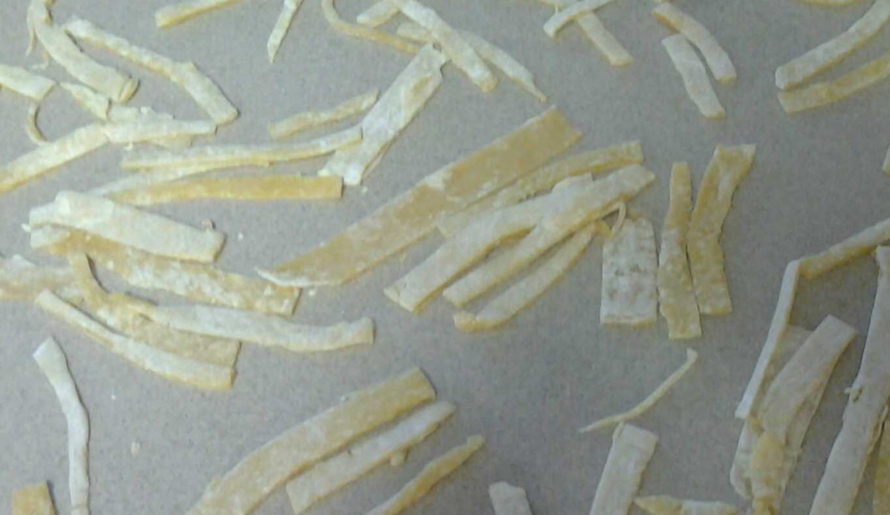
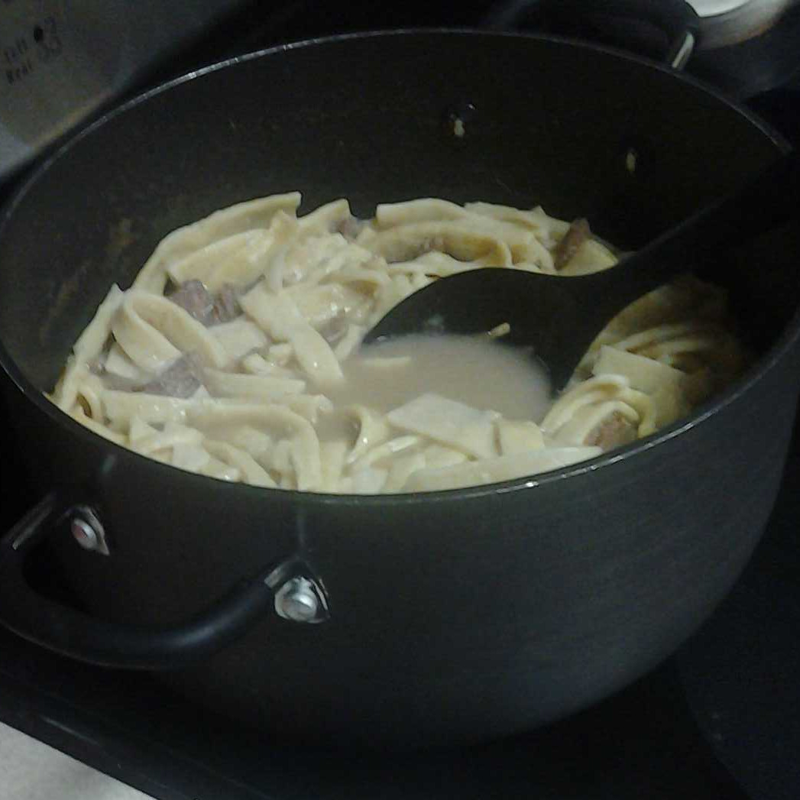

# Homemade Egg Noodles

These egg noodles are another one of my grandma's recipes -- they were one
of my mom's *favorite* foods growing up, so they are a common fixture in my
house around her birthday.

This recipe will make enough for about six to eight people,
depending on appetite levels.

### Ingredients

(All units are American customary.)

* 3 egg yolks
* 1 egg
* 3 tablespoons of water
* 1 teaspoon of salt
* 2 cups of flour
* 1 pound of beef short ribs

### Equipment

* Large mixing bowl
* Large pot
* Noodle-slicing machine

### Directions

First, you have to make the raw noodles:

* Mix all ingredients thoroughly (except short ribs) in the mixing bowl.
* Spread the dough and flatten it into a sheet, as thin as you can get it.
* Use the noodle-slicing machine to cut the dough into individual noodles.
  (Or, just cut it with a knife.)
* Allow the noodles to dry for 8 to 10 hours. They'll look like this:

Then, to actually cook them:

* Place the beef short ribs in the pot.
* Cover the short ribs with water, and cook for one hour.
* Add the noodles, and cook for an additional 45-60 minutes.
* Serve! (They usually need salt.)

