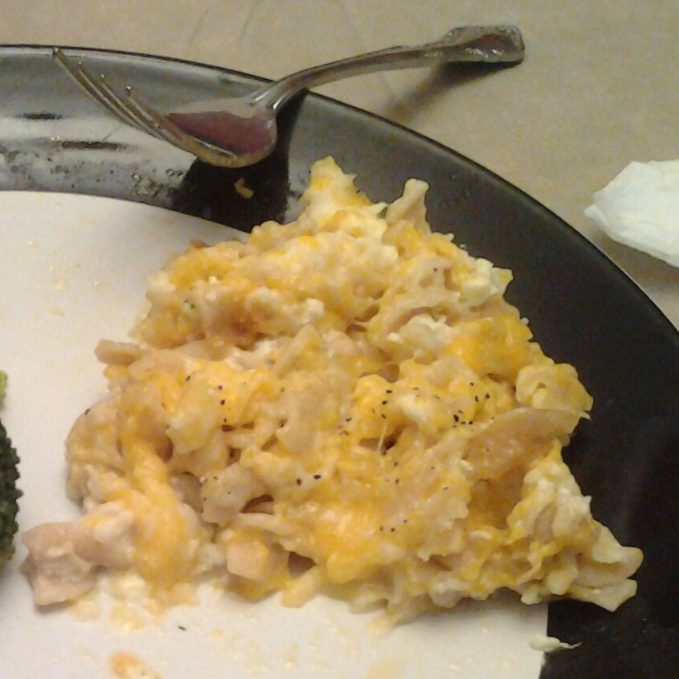

# Macaroni and Cheese

My mom and grandma both have macaroni and cheese recipes:
Grandma's is made in a crock pot with eggs and butter and flour and other
deliciousness, while Mom's is baked (but doesn't have as many of the extras).
Both of them make their mac and cheese from memory, so mine is a synthesis of
what I remember from theirs. (It's also why I don't have precise amounts
for most of the ingredients.)

Some people use macaroni and cheese as a side dish,
but I prefer to use this as the main course, possibly serving smoked
sausage on the side. It also pairs well with broccoli or string beans.

This recipe will make enough for about eight to ten people,
depending on appetite levels.

### Ingredients

(All units are American customary.)

* 1 box of macaroni (other pasta works too...I commonly use rotini)
* 2 cups of shredded cheddar cheese (or maybe more)
* 2 cups of shredded mozzarella cheese (or maybe more)
* 2 eggs
* Milk (I don't actually know how much...it's probably more than a half cup
  and less than two cups)

### Equipment

* Oven
* Pot big enough to fit all the pasta (see box)
* 9"-by-13" baking dish

### Directions

* Preheat your oven to 350 degrees Fahrenheit.
* Cook the pasta, according to the directions on the box.
* Mix together the pasta, the eggs, some milk, and about two thirds of the
  cheese in the baking dish.
* Add the rest of the cheese to the top of the dish.
* Bake for 30 to 45 minutes. (The mac and cheese should start to get brown,
  but not get *really* brown.)
* Serve!

